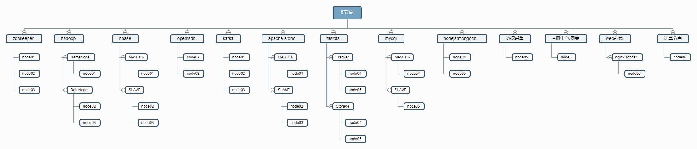
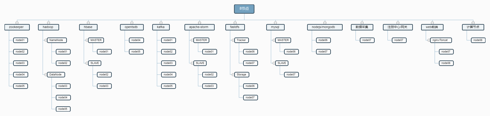
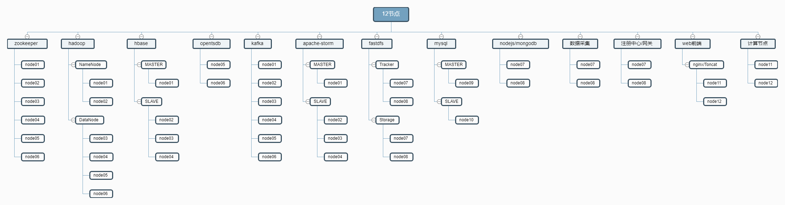

## 安装说明


 - 1.请根据实际主机数量选择配置模板
 - 2.执行安装前需要修改conf.cfg 配置文件中配置参数
   - 0.SERVERS  (服务器IP)
   - 1.HOSTS    (服务器主机名)
   - 2.NET      (网卡名称)
   - 3.KEEP_VIP (fastdfs 资源访问高可用)
   - 4.SSH_PASS (ssh密码)
   - 5.SSH_PORT (sshd端口)
 - 3.在namenode 其中一节点执行 步骤: 0, 1, 2, 4
 - 4.在所有节点执行 步骤: 3

## 架构图

[6节点图](./image/host-6.svg)



[8节点图](./image/host-8.svg)



[12节点图](./image/host-12.svg)



## 0.下载解压脚本(node01执行)

```
git clone https://github.com/bigdatasafe/mg-auto-install.git
cd mg-auto-install
```


## 1.创建conf.cfg 配置文件(node01执行)

> 选择配置文件模板

    cp host-6.cfg conf.cfg    # 如果是6节点执行此命令否则忽略

    cp host-8.cfg conf.cfg    # 如果是8节点执行此命令否则忽略
    
    cp host-12.cfg conf.cfg   # 如果是12节点执行此命令否则忽略

根据实际情况修改 SERVERS,HOSTS,NET,SSH_PASS,KEEP_VIP 参数


## 2.下载软件及安装脚本推送到所有节点(node01执行)

    ./download.sh

> download.sh 执行过程

 - 1. 执行download.sh
   - 1.1. 安装wget expect
   - 1.2. 配置秘钥登录所有节点
   - 1.3. 下载软件后台推送到其他节点
   - 1.4. 下载安装脚推送到其他节点

## 3.安装软件(所有节点执行)

    cd /home/software && sh install.sh

> install.sh 执行过程

 - 1.初始化(所有节点)
   - 1.0. 设置主机名,hosts解析
   - 1.1. 优化ssh连接速度
   - 1.2. 关闭selinux,防火墙
   - 1.3. 配置YUM源(阿里云)
   - 1.4. 配置时间同步(阿里云)

 - 2.根据配置文件中的变量判断当前节点需要安装的服务执行安装

## 4.执行环境初始化(node01执行)

> hadoop 初始化, 执行完成后检查 hadoop 状态确认正常后再初始化 opentsdb

    sh /home/software/init-hadoop.sh
    
    # 确认初始化完成后删除初始化脚本
    rm -f /home/software/init-hadoop.sh

> opentsdb 初始化

    sh /home/software/init-opentsdb.sh.sh
    
    # 确认初始化完成后删除初始化脚本
    rm -f /home/software/init-opentsdb.sh.sh

> mysql 主从配置(mysql服务器为2节点时)

    sh /home/software/init-mysql-cluster.sh

## 5.服务管理(仅node01有效)

    # hadoop 集群管理方式
    mango stop    # 关闭服务
    mango start   # 启动服服务

    # 其他服务管理
    systemctl {stop|start|status|restart} mysql
    systemctl {stop|start|status|restart} redis
    systemctl {stop|start|status|restart} tomcat
    systemctl {stop|start|status|restart} haze
    systemctl {stop|start|status|restart} fdfs_trackerd
    systemctl {stop|start|status|restart} fsfs_storaged

## 6.查看服务安装信息

    sh /home/software/info.sh {ip/hosts}